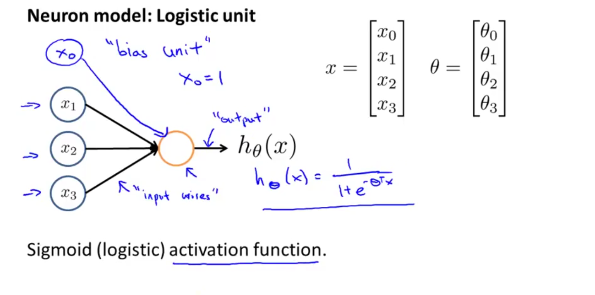

## Neural Networks

- Last class we discussed Supervised Learning,where we fed data to the model and got predictions
- In Supervised Learning,we used a specific algorithm,to process the data
- In the domain of deep learning,we primarily use Neural Network
- In,Neural Networks,we define a task and the network tries to "learn",the function,on it's own 
- A neural network is comprised of many "layers"
- There are three types of layers,input,output and hidden
- The hidden layers are layers,which come in between the input and output
- They are called,"hidden',because,what goes in them,is unknown to us,and we have no role in setting their state
- The dimensionality of these hidden layers represent,the "width" of the model
- Each layer in the Neural Network,consists of "nodes" or also called "units"
- Nodes are linked to each other by a "transition matrix" - 
- A "transition matrix,is a matrix of weights,controlling the functions,mapping from layer j to layer j+1 
- Each unit has it's own activation function 
 

  

- Now to compute the cost function,we use a technique called,forward propagation
- We multiply all the nodes with their transition matrices and feed it as input to the node of the next layer 
